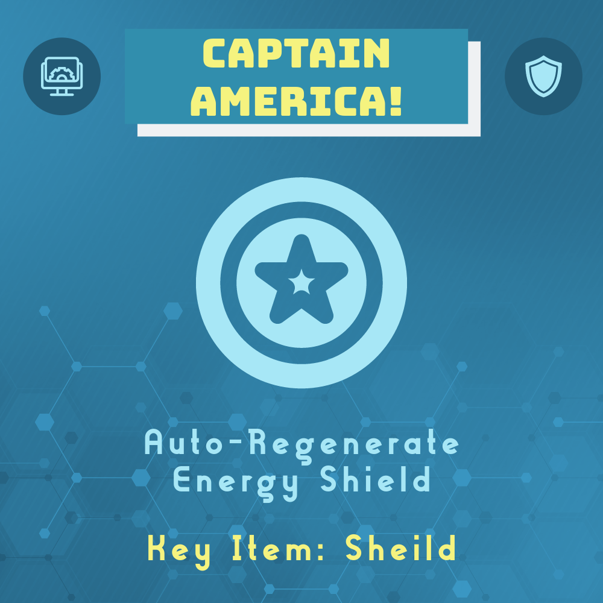
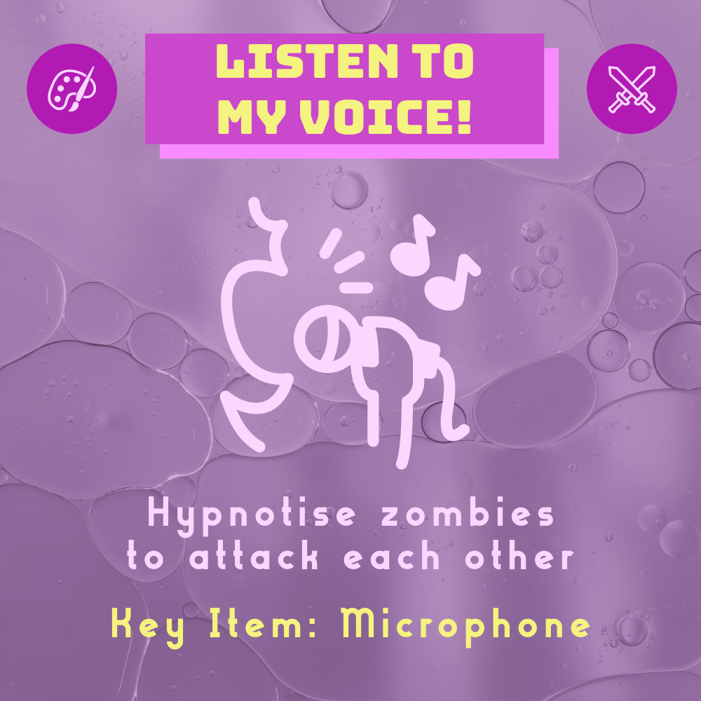
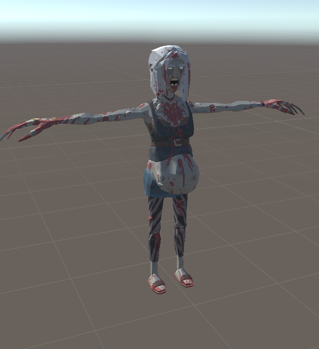
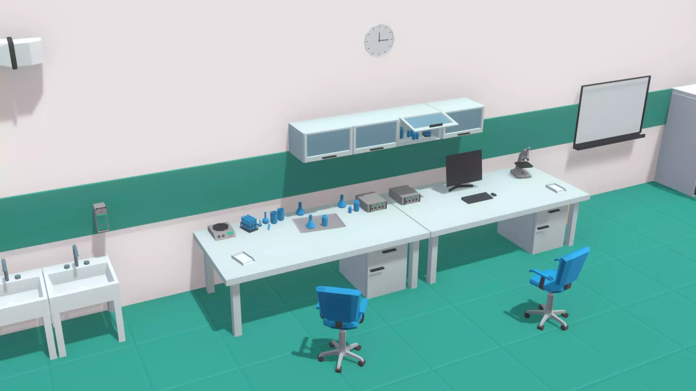
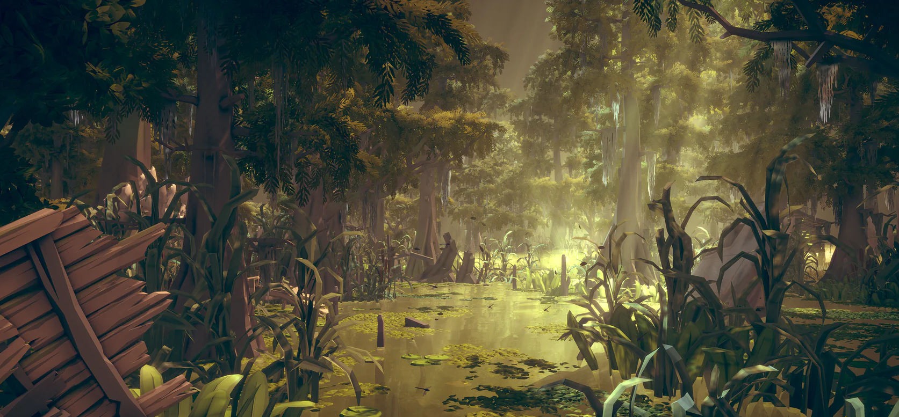
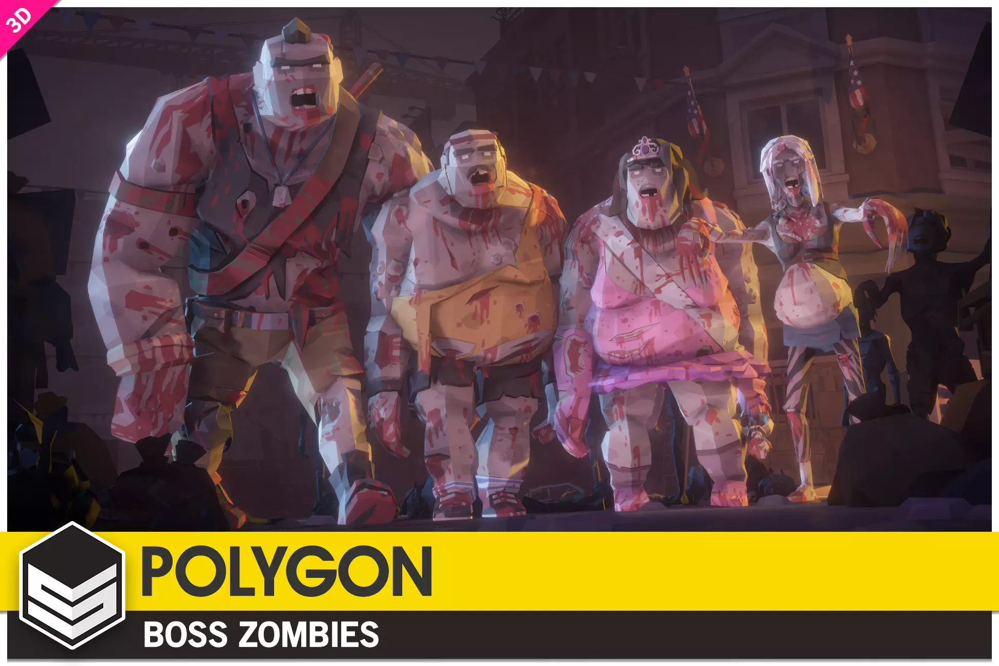
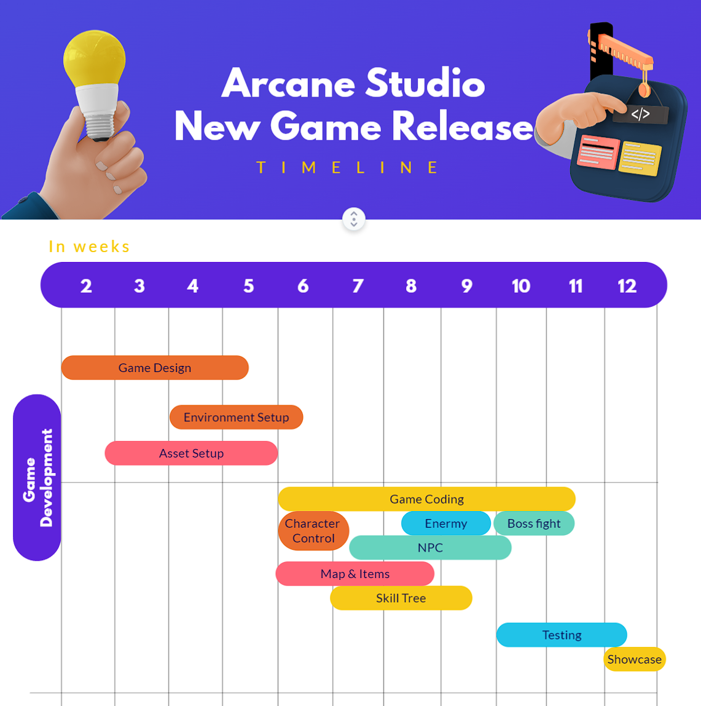

# Game Design Document (GDD)

## Game Overview 📑

### Core Concept 💡

This game is a unique zombie survival game set on the sprawling campus of a university during an on-campus zombie apocalypse set forth by rebellious students. Surrounding the themes of horror, survival, exploration, and character progression, this game aims to recreate the stressful experience every student shared during their university life. Hence, players take on the role of a student who must fight through the undead-infested campus by scavenging valuable resources and intel and utilising them to uplevel their skillset to survive the onslaught while being hunted by the undead.

  

### Genre 🎲

The game belongs to the role-playing, survival-horror, and action-adventure genres. It draws inspiration from the survival classic, The Last of Us, and zombie apocalypse classic, Left 4 Dead 2 while incorporating character progression and a unique twist of an academic environment setting which is the university. The main elements of these three genres, survival, horror, stress, and adrenaline, are a perfect fit for a university-themed game as they summarise the university experience which most students can resonate with.

  

### Target Audience 👨‍👧‍👦

The game targets players who are university students or graduates. The target audience also includes players who enjoy zombie-survival games. The innovative integration of the university theme is perfect for those who seek ways to distress from their stressful study life. On top of that, the game's engaging blend of survival-horror makes it appealing to players seeking challenging and immersive experiences.

### Unique Selling Points (USPs) ⭐

- **University Setting** 
Relive the "nightmare" we all experienced during our university days and wage war on university life in a way that only existed in our imagination through the game's backstory, offering a fresh take on the zombie apocalypse, creating a rich environment for exploration and strategy.
- **Diversified Skill Development** 
The game offers a wide range of skills for players to develop, ranging from offensive skills to defensive skills, allowing players to choose their own playstyle and develop their own unique character. Characters acquire unique skills depending on their academic field of study.
- **Dynamic Intel and Items** 
Intel and items available vary depending on the faculty the area the player is on belongs to. Intel and items for each faculty are designed to mimic the different knowledge learned from that faculty in university. For example, the Faculty of Engineering and IT will have intel and items related to engineering and IT, such as robots, and would require relevant knowledge or intel to find these items.

## Story and Narrative 📖

### Backstory 📜

This game is set amid a zombie outbreak from a biological attack. Due to the immense study pressure and the ill-treatment from the university and academic staff, biologists-to-be biomedicine students went rogue. They conducted an ill-omened experiment that unleashed a highly contagious and (un)deadly virus. The infection spread rapidly, turning students, staff, and faculty into flesh-hungry zombies.

  

Fortunately, they were not paying attention in class before (Phew 😮‍💨). Hence, the design of the virus was not perfect, so some university members (those who already look dead due to constant pressure and lack of sleep) survived the outbreak. The Villainous Student who created the virus realises their mistakes and starts to hunt down the survivors. The once-thriving campus has become a chaotic battleground for survival for these students, and they must escape thru a portal before it is too late. To survive and escape, students must collect resources and intel to develop their skills to beat the zombies and the evil student.

  

### Story Progression 📈

As the player explores the university, they uncover information that reveals the events leading to the outbreak and research backlog of the virus. The narrative unfolds through these discoveries and interactions with NPCs. The overarching goal is to gather information about the virus, discover the Villainous Student's weaknesses, and master relevant skills to beat the villain and escape the campus.

  

## Characters 👥

### The Protagonist

#### Background 📜

The protagonist is a student with practical skills and invaluable academic knowledge. With diverse faculties, the protagonist's past experiences range from scientific inquiry to artistic expression. Originating from one of three faculties—Biomedicine and Chemistry, Engineering and IT, or Arts and Music—shapes the protagonist’s core abilities, the range of developable skills from other faculties, and their initial outlook on the unfolding apocalypse.

  

#### Goals 🎯

The protagonist's immediate goal is to escape the campus and its horrors. Driven by the desire to survive and uncover the truth behind the outbreak, the protagonist navigates the campus to collect items and unravel valuable information that will aid their attempt to escape from the Villainous Duo.

#### Faculty 🎓

Every faculty has its respective offensive and defensive Study Plan (skill tree). The protagonist can unlock all the non-key skills using Study Points (XP) within the same faculty. Each player can unlock only one key skill from its own faculty and one from another faculty at any time in-game. Player can unlearn a key skill and learn another key skill. Each key skill requires a respective key item to  unlock.

All skills are further categorised into passive (P) and active (A) skills. All passive skills will be automatically equipped and used after unlocking. Active skills can be equipped but only be used once by the player during each escape round (More details in the Gameplay and Mechanics section).

- **Biomedicine and Chemistry** 💊 
Their background in biology, chemistry, and medical studies equips them with a keen understanding of the infection's mechanisms and a mastery over chemicals. 
  - **Skills**:
    | **Offensive Skill 1 (P)**| **Offensive Skill 2 (P)**| **Offensive Key Skill (P)**|
    | --- | --- | --- |
    | 

 | 

 | 

 |

    | **Defensive Skill 1 (P)** | **Defensive Skill 2 (P)** | **Defensive Key Skill (P)** |
    | --- | --- | --- |
    | 

 | 

 | 

 |

- **Engineering and IT** 💻 
Their background in technology and engineering skills allow them to unravel the mysteries of the apocalypse using their technical prowess, both digitally and physically.
  - **Skills**:
    | **Offensive Skill 1 (A)** | **Offensive Skill 2 (P)** | **Offensive Key Skill (A)**|
    | --- | --- | --- |
    | 

 | 

 | 

 |

    | **Defensive Skill 1 (P)** | **Defensive Skill 2 (A)** | **Defensive Key Skill (P)** |
    | --- | --- | --- |
    | 

 | 

 | 

 |

- **Arts and Music** 🎨 
Their background in the arts and music grants them a unique perspective on survival, allowing them to utilise their creative talent to slip thru the grasp of the zombies.
  - **Skills**:
    | **Offensive Skill 1 (A)** | **Offensive Skill 2  (P)**| **Offensive Key Skill (A)**|
    | --- | --- | --- |
    | 

 | 

 | 

 |

    | **Defensive Skill 1 (P)** | **Defensive Skill 2 (P)** | **Defensive Key Skill (A)** |
    | --- | --- | --- |
    | 

 | 

 | 

 |

### 2. The Villainous Student

#### Background 📜

The enigmatic mind behind the zombie disaster who conducted the evil experiments that created and unleashed the zombie virus. They stand as overwhelming villains in their apex evolutionary form and are infused with unparalleled intelligence and abilities. During every escape attempt, they actively target the main character and instruct other zombies to initiate an attack. At some point in the game, the duo will catch up with the protagonist and teleport them to a fight. The player must defeat them to escape.

Their research notes on the virus are scattered across the campus and are crucial to understanding the infection and the duo's weaknesses. Learning these grant you Study Points.

| The Villainous Student |
| --- |
| 

 |

#### Goals 🎯

Their goals stem from a desire to assert revenge on the whole university, which they claimed had been maltreating them the whole time. Their actions are guided by an arrogance rooted in their intellect. They seek to destroy anyone standing in their way, making them a formidable challenge for the protagonist.

### 3. The Undead 🧟

#### Background 📜

Once lovely or not-so-lovely university members, these zombies are victims of a catastrophic infection that stripped them of their former selves. Bereft of intellect and humanity, it embodies the grim reality of the undead horde. Amid the chaos of the apocalypse, the undeads serve as the moving target for the students to practise their newly acquired skills and gain experience before any boss fights. There are four kinds of Undeads besides the Villainous Duo.

#### Goals 🎯

Driven by the virus's primal impulses and direct orders from the Villainous Duo, the undead’s only motivation is to satisfy their insatiable craving for human flesh. With no goals beyond the pursuit of living beings, the undead’s sole purpose is to not feel hungry by feeding themselves flesh and brains.

#### Undead Types 🧟

| Undead Type | Description | Image |
| --- | --- | --- |
| The Usual One | The most common type of zombie you would expect, slow, weak and short-range attack. | 

 |
| The Spitter | These zombies have developed a mutation that allows them to project acidic saliva at a distance. These undead have a longer range of attack, but their damage point is lower. | 

 |
| The Crawler | These zombies have lost the use of their legs.  While slower than regular zombies, they may surprise players by suddenly lunging at them, dealing the highest damage among all undead and having the highest health points. | 

 |
| The Feral | These zombies have undergone a more profound transformation, displaying heightened speed, agility, and strength. It may be more challenging to escape, but they are more susceptible to attack due to their lower health points. | 

 |

### 4. The Survivors 🫂

#### Background 📜

The innocents (or maybe not) who are going through the same disastrous experience as the protagonist. With diverse academic backgrounds, each survivor possesses unique knowledge, experiences, and aspirations, assisting the protagonist in navigating their way out. Most of them are on the edge of death, staying there and trying to make the most of their last breath. Throughout the game, the player encounters other survivors with unique backgrounds, each offering different intel and information.

#### Goals 🎯

Each survivor's motivation is to reunite with loved ones, seek redemption, or uncover hidden truths, but time is running out for them. Their desires, grounded in their pasts, shape their choices and interactions. Ultimately, their shared goal is the survival of the innocent, who still have a chance to escape. Their unique knowledge offers the protagonist diverse assistance when facing challenges from the undead horde.

#### Survivor Types 🧑‍🤝‍🧑

- **Faculty-Based**
  | **Survivor Type** | Image |
  | --- | --- |
  | Survivor | 

 |
  | Tutorial Character | 

 |

## Gameplay and Mechanics 🕹️

### Overview 📑

The game is set on a apocalyptic university campus where a zombie virus outbreak occurs due to a biological attack. Players will take on the role of a resourceful student who, while battling hordes of undead creatures, strategically arms themselves with different skills  to eventually escape.

### Player Perspective 🎥

The game is mainly presented in a first-person perspective, creating a strong sense of immediacy and vulnerability. The camera serves as the player's eyes, allowing them to see the world through their character's viewpoint. As the player controls the character's movements, the camera smoothly follows their actions, adjusting to the character's orientation and direction. This dynamic perspective enhances the gameplay experience by offering a balance between the player's direct control over the character while navigating through the campus and confronting chasing zombies.

  
  
 Main view from the first-person perspective.

### Controls ⌨️

The game is controlled using a keyboard and mouse. The keyboard is used to move the character around the campus and interact with the environment. The mouse is used to control the camera and aim at enemies. The mouse is also used to interact with the UI elements.

  

#### Keyboard Controls ⌨️

- **W, A, S, D**: Move the character forward, left, backward, and right.
- **1 to 4**: Up to four skills can be assigned to these buttons, and corresponding skill will be released upon detecting a click action.
- **Shift**: Sprint for a short burst of speed, consuming stamina.
- **Space**: Jump over obstacles or gaps.
- **Q**: Utilize the special skill that is currently equipped.
- **R**: Reload equipped weapons if available.
- **F**: Select dialogue options, pick up items, and interact with various in-game elements.
- **Tab**: Open the Skill Menu, showing current location and objectives.
-  **M** : Open the Map, showing the entire campus.
-  **I** : Open the Inventory, showing the items collected.
- **Esc**: Pause the game and access the in-game menu.

#### Mouse Controls 🖱️

- **Left Mouse Button (LMB)**: Fire equipped weapons.
- **Mouse Movement**: Control the camera and aim at enemies.
- **Mouse Click**: Select dialogue options and interact with UI elements.
- **LMB (Hold) + Mouse Movement**: Swing weapons in different directions during combat.

The synergy of keyboard and mouse controls ensures a fluid navigation of the campus, seamless combat engagement and environmental interaction. The keyboard primarily governs character movement and the casting of special skills, while the mouse offers precise camera control, accurate aiming, and interaction with objects.

### Progression 📈

#### Initial Setup

At the start of the game, players assume the role of a freshman student. Upon their first entry into the game, players customise their character's name and chosen major. The game primarily offers three initial majors: Biomedicine and Chemistry, Engineering and IT, and Arts and Music, each granting distinct starting weapons. After creating the player character, they can embark on repeated attempts to escape the perilous situation.

#### Escape Rounds

During each escape round, players begin by selecting a location on the campus map to spawn, equipped with a weapon from the unlocked major. Zombies appear randomly in close proximity to the spawn point and initiate pursuit once the player is near, causing damage within a specific range. Various types of zombies exhibit distinct attack strengths, radii and movement speeds, offering players the choice between evasive manoeuvres and confrontational combat.

Every escape attempt grants players a five-minute window for unrestricted map exploration. Within this timeframe, players can engage in combat with zombies to earn Study Points (XP), engage in conversations with survivors for information, and gather key items to unlock key skills. Subsequently, the villainous duo emerges to transport the player to the final arena. Successful elimination of the boss signifies a triumphant escape, whereas failure to defeat the boss leads to an unsuccessful escape. Additionally, players must safeguard their health above zero from enemy attacks throughout the entire escape. Failing to do so also results in the player's death and escape failure.

#### Study Points (XP)

As players advance through each game round, they can accumulate XP by exploring diverse campus areas, engaging in combat with zombies using combat skills. The amount of XP earned from defeating different types of zombies may vary depending on their difficulty level.

Upon successfully completing an escape round, the accumulated XP will be awarded based on the player's achievements during that game round. Conversely, in case of failure, a portion of the XP collected within that specific round will be lost.

#### Study Plan (Skill Tree)

Each available major for the player character has an exclusive study plan, encompassing four regular skills and two key skills primarily focusing on defense and offense. These skills represent the expertise and knowledge gained from studying the chosen major. In every escape round, players have the opportunity to equip a key skill from their major's field and an additional key skill from a different faculty.

All skills, except for key skills, can be unlocked and enhanced using XP, while key skills require hidden key items collected during each escape round to unlock. By default, the equipped key skills remain consistent across escape attempts, but they can also be switched to other unlocked key skills by investing additional XP.

  

#### Key Items

Key items are items that can be discovered in predetermined and concealed locations throughout the campus, serving the purpose of unlocking key skills across all faculties. During each escape round, players are granted the liberty to gather as many items as they desire; however, only one of these items can be utilized to unlock a locked key skill once the escape round concludes. Players can obtain information about different key items by engaging in conversations with survivors who sporadically emerge on the campus or through serendipitous discovery. Once a key item has been used to unlock the corresponding key skill, it will disappear from the map, rendering it unobtainable thereafter.

  

#### Progression and Strategy

Initially, players may encounter difficulties progressing directly due to their low professional level and the modest damage dealt by basic weapons. However, with persistence and repeated attempts, players obtain pivotal Study Points (XP) to enhance their skills.

As players accumulate Study Points (XP), which can be utilized to unlock or enhance skills within their selected skill tree, they possess the opportunity to strategically distribute their Study Points in alignment with their preferred playstyle or the potential challenges they expect to encounter. Upon obtaining certain key items, players acquire the capacity to access extra influential key skills, thus offering them the choice to invest in combat, stealth, survival, or a combination of these facets. This introduces a strategic dimension to character development, imparting depth to their tactical choices.

### Gameplay Mechanics ⚙️

The player's objective centers on undertaking time-limited escapes to confront the villainous duo and secure their escape from the campus. Each attempt, whether met with triumph or setback, contributes to the player's accumulation of knowledge and resources, gradually familiarizing them with the intricacies of the campus. The iterative attempts eventually evolve into a strategic advantage, aiding them in their quest to conquer the final boss and achieve the sought-after escape.

The pursuit of successful escapes serves as a compelling motivator, urging players to persistently undertake successive attempts. This relentless effort is geared towards continually unlocking and improving their character's skills through Study Points (XP) or gathering key items. This cycle of growth serves as a driving force to conquer challenges and emerge victorious. The integration and synergy of diverse skills further amplify the strategic depth and overall gameplay experience.

## Levels and World Design 🗺️

### Overview 📑

The game features 3D graphics and a single-level open-world design allowing players to freely explore the zombie-filled apocalyptic university campus. Having an open-world design encourages and rewards players for their curiosity, ensuring an engaging gameplay experience. Players will have to gather intel and use the intel to search for key items found on campus to unlock new skills and get progressively stronger, allowing their eventual escape. Paring 3D graphics with an open-world design offers players unparalleled immersion. Buildings are modelled to allow players to enter them to collect key items or seek shelter from zombies.

  
  
A university building interior.

### Game World 🗺️

The game world is a zombie-filled apocalyptic university campus. The campus is located on the edge of a forest to keep players on edge, emphasising the stressful and survivalist atmosphere of the game. The forest is designed in a way to elicit tension and suspense from players. The game world replicates a real-world campus with housing, open spaces, and buildings designated for each faculty.

  
  
University campus map.

Players can access the university campus map by pressing Tab on their keyboards. Like students in the real world, players navigate the campus by walking or sprinting. Escape rounds will happen during the night to support the game's horror theme. The moonlight will be the primary light source in the game world.

### Building Designs 🏛️

The university buildings have a modern design with a zombie-apocalyptic aesthetic. The zombie-apocalyptic aesthetic is achieved through having overgrown weeds surrounding buildings and shattered windows.

| Small University Building | Medium University Building | Large University Building |
| --- | --- | --- |
| 

 | 

 | 

 |

### Interior Designs 🪑

Buildings have interiors that fit the faculty the building belongs to. Engineering and IT buildings will have engineering labs and computer labs. Arts and Music buildings will have art studios and recording studios. Biomedicine and Chemistry buildings will have biology labs and chemistry labs.

| Biology Lab | Chemistry Lab |
| --- | --- |
| 

 | 

 |

Biology labs and chemistry labs. From https://assetstore.unity.com/packages/3d/environments/low-poly-chemical-lab-186606.

Players are able to interact with the doors inside buildings. It is dark inside buildings to simulate that there is no electricity during a zombie apocalypse. Having unlit interiors helps with the realism and horror characteristics of the game. Players will find and collect key items inside buildings. Key items for a faculty can be found in that faculty's buildings.

### Forest Designs 🌲

The forest is designed to have an eerie and unwelcoming atmosphere to support the game's survivalist and horror theme. The forest's eerie and unwelcoming atmosphere is achieved using a swamp biome with an abandoned aesthetic.

  
  
  
  
Forest designs. From https://syntystore.com/products/polygon-swamp-marshland-nature-biome.

### Physics ⚛️

The game follows real-world physics as closely as possible. So elements like lighting and character movement will follow the real world as closely as possible taking into account the processing and rendering capabilities of WebGL.

### Items 📦

Items are scattered throughout the game world. Items are divided into three categories: key items, consumable items, and Study Points(XP) items. Players can interact with and pick up items when they are close to the items.

#### Key Items 🗝️

Key items are items that are required to unlock key skills. Key items are scattered throughout the game world but hidden within the faculty area it belong to and can only be found by either exploring the game world or through the intel provided by the survivors. Key items are unique to each faculty and each key skill.

For the faculty of Engineering and IT, the key item for the key offensive skill will be a robot and the key item for the key defensive skill will be a shield.

| Robot | Shield |
| --- | --- |
| 

 | 

 |

For the faculty of Biomedicine and Chemistry, the key item for the key offensive skill will be a microscope and the key item for the key defensive skill will be an AED.

| Microscope | AED |
| --- | --- |
| 

 | 

 |

For the faculty of Arts and Music, the key item for the key offensive skill will be a microphone and the key item for the key defensive skill will be a palette.

| Microphone | Palette |
| --- | --- |
| 

 | 

 |

#### Health Items 💊

Health items are items that are be used to restore health. Health items are scattered throughout the game world.

| Health Pack |
| --- |
| 

 |

### Ammo Items 🔫

Ammo items are items that are used to restore ammo. Ammo items are scattered throughout the game world.

| Ammo |
| --- |
| 

 |

#### Study Points (XP) Items 🧾

Study Points items are items that grant player Study Points to unlock skills. Study Points items are scattered throughout the game world in the form of books.

| Book |
| --- |
| 

 |

## Art and Audio 🖌️

### Art Style 🎨

The game features a fictional low polygon art style. A fictional low polygon art style was mainly chosen to ensure that the game is not computationally and graphically heavy so that it can run on WebGL. Having a fictional low polygon art style implies that the game has a low amount of polygons, requiring less processing and rendering power to run smoothly.

  
  
Fictional low ploygon art style. From https://www.unrealengine.com/marketplace/en-US/product/low-poly-style-deluxe-mountain-environment.

The fictional low polygon art style also complements the fictional characteristics of the game well and helps make playing the game feel more cohesive and coherent. A fictional and low polygon art style also makes game development easier and more manageable, considering that we are only a small team of game developers with limited time and resources to develop the game.

### Sound and Music 🎧

#### Sound Design 🔊

Although with a low-poly graphic design, the sound design in this game is to be realistic, sound effects of player interacting with different game objects is realistic, much like Minecraft. Sounds such as wind, footsteps of zombies, gunfire, and collision sound of objects, will be included in the game.

#### Music 🎵

No background music will be used except for the final boss fight to create an immersive feeling like real world. Boss fight will use energetic, thrilling yet terrifying music, to give the player an intense feeling of excitement.

AI-generated music: <https://soundraw.io/edit_music?m=64d9bba0dbfd630014f962cf>

#### Sound Effects 💥

- Do not include any background music except boss fight
- Sound should be as realistic as possible
- Player should be able to use sound as a source of enemy direction / judges energy distance
- Boss fight should include an epic style background music
- Zombie sounds are a clue of their directions
- Zombie attacks should be terrifying and visceral
- When player is low in health audio will become muffled to simulate weakening senses

<https://artlist.io/sfx/search>

### Assets 📦

Assets used for this game are sourced from the Unity asset store.

| Asset | Preview | URL |
| --- | --- | --- |
| POLYGON Apocalypse - Low Poly 3D Art by Synty | 

 | <https://assetstore.unity.com/packages/3d/environments/urban/polygon-apocalypse-low-poly-3d-art-by-synty-154193> |
| POLYGON Boss Zombies - Low Poly 3D Art by Synty | 

 | <https://assetstore.unity.com/packages/3d/characters/humanoids/fantasy/polygon-boss-zombies-low-poly-3d-art-by-synty-173373> |
| Low Poly Combat Drone | 

 | <https://assetstore.unity.com/packages/3d/low-poly-combat-drone-82234> |

## Game User Interface (UI) 🖥️

The game's UI is designed to suit a typical shooter game. The game's UI style is based on [minimal design](https://designshack.net/articles/trends/minimal-design-rules/#Minimal%20Design%20Best%20Practices%20and%20Tips).

| **UI Element** | **UI Preview** | **Key Design** |
| --- | --- | --- |
| Main Menu | 

 | Typical main menu design |
| Pause Menu | 

 | 

 |
| Main View | 

 | 

 |
| Main View (With Trophy) | 

 | 

 |
| Low Health | 

 | 

 |
| Hit Feedback | 

 | 

 |
| Interaction Input Hint | 

 | 

 |
| Map | 

 | 

 |
| Skill Tree | 

 | 

 |

## Technology and Tools 🛠️

**Repository** 
Github 
<https://github.com/>

**Game Engine** 
Unity Engine 2022.3 LTS 
<https://unity.com/products/unity-engine>

**3D Modelling Software** 
Blender 3.6.2 LTS 
<https://www.blender.org/>

**Raster Graphics Editor** 
Photoshop 24.7 
<https://www.adobe.com/au/products/photoshop.html>

**Vector Graphics Editor** 
Photoshop 27.8 
<https://www.adobe.com/au/products/illustrator.html>

**User Interface (UI) Design Tool** 
Figma 
<https://www.figma.com/>

## Team Communication, Timeline and Task Assignment 🤝

### Tools 🔧

| Tool | Used For | Link |
| --- | --- | --- |
| Discord | General team communication and stand-up meetings | <https://discord.com/channels/1133958162899284008/1133958163406798900> |
| Jira | Task management | <https://arcanestudio.atlassian.net/jira/projects?selectedProjectType=software> |
| Confluence | Documentation | <https://arcanestudio.atlassian.net/wiki/spaces/ArcaneStud> |
| Github | Code and asset management | <https://github.com/COMP30019/project-1-arcane-studio> |

### Timeline 📆

  

### Task Assignment 📋

  

## Possible Challenges and Risks ⚠️

| **Challenge** | **Trigger** | **Risk** | **Mitigation** |
| --- | --- | --- | --- |
| Time constraints in learning new technology. | Certain tools that are required, such as the Unity Engine and Blender, are new to our team.  Team is faced with a lack of familiarity in the realm of 3D game development. | Highly Likely | Utilising of the resources available during workshops and exercising judicious tool selection to minimise the need for future decision alterations.  Facilitate technical discourse sessions to mitigate the risk of decision maker underestimating the workload. |
| Team is not able to finish the project. | The team does not prioritise the main goal of the project, instead focus more on secondary requirements such as character modelling and mechanic design.  The team members are concurrently engaged in other subjects, and there is a concern that the designated time for this project might fall short of our initial expectations. | Highly Likely | Strategically seek out and incorporate open-source models, particularly animations and assets to alleviate the developmental burden on the team.  Hold weekly team meetings to assess the progress of tasks.   Implement agile methodology to progressively introduce supplementary features to the project through iterative phases. |
| Team member becomes unreachable. | Due to personal or unforeseen circumstances, such as dropping the subject. | Moderately Likely | Adjust the requirements in alignment with the timeline, thereby reshaping a scope that is realistically attainable. This could involve the omission of certain characters and mechanics outlined in the original design.  Use the communication platform to ensure consensus among all team members regarding the current progress, choices undertaken, and tasks allocated to each individual. This practice will contribute to overall satisfaction and harmony within the team. |
| Unmet development expectations with low coding productivity. | The development team is grappling with unfamiliarity regarding the employed tools.  Additional requirements are introduced by team members.  The team is adhering to deadlines through rushed efforts.  There has been a misunderstanding among team members regarding the assigned requirements. | Highly Likely | Pair programming and technical support sessions to allow team member lacking experience easily solve their technical problem.  Peer review code via pull requests.  Establish the project's requirements and scope by August 27, 2023. Any subsequent adjustments should be formulated, deliberated upon, and mutually agreed upon by all team members during weekly meetings. |
| Ineffective Team Communication. | Team members are not able to communicate effectively due to language barriers.  Team members are not able to communicate effectively due to different schedules. | Moderately Likely | Ask questions when in doubt for clarification.  Respect the difference among all teammates.  Be patient to explain your idea and while listening to others.  Team members should utilise all tools to communicate effectively. |
