# Project 2 Report

## Table of Contents

- [Project 2 Report](#project-2-report)
  - [Table of Contents](#table-of-contents)
  - [Evaluation Plan](#evaluation-plan)
    - [Objective](#objective)
    - [Evaluation techniques](#evaluation-techniques)
      - [Cooperative Evaluation](#cooperative-evaluation)
      - [Questionnaires](#questionnaires)
    - [Participants](#participants)
    - [Data Collection](#data-collection)
    - [Data Analysis](#data-analysis)
    - [Timeline](#timeline)
    - [Responsibilities](#responsibilities)
  - [Evaluation Report](#evaluation-report)
    - [Game Evaluation Questionnaire](#game-evaluation-questionnaire)
      - [1. Questionnaire Evaluation 📑](#1-questionnaire-evaluation-)
      - [2. Questionnaire Feedback Analysis 📈](#2-questionnaire-feedback-analysis-)
    - [Cooperative Evaluation](#cooperative-evaluation-1)
      - [1. Cooperative Evaluation 📑](#1-cooperative-evaluation-)
      - [2. Cooperative Evaluation Feedback Analysis 📈](#2-cooperative-evaluation-feedback-analysis-)
    - [Modifications and Improvements 🕹️](#modifications-and-improvements-️)
  - [Shaders and Special Effects](#shaders-and-special-effects)
    - [Force Field Shader](#force-field-shader)
      - [Fresnel Effect](#fresnel-effect)
      - [Fresnel Shader](#fresnel-shader)
    - [Portal Shader](#portal-shader)
      - [How it works](#how-it-works)
    - [Blood Particle System](#blood-particle-system)
      - [How it works](#how-it-works-1)
      - [Base texture](#base-texture)
      - [Duration, Speed and looping](#duration-speed-and-looping)
      - [Randomness](#randomness)
  - [Summary of Contributions](#summary-of-contributions)
  - [References and External Resources](#references-and-external-resources)
    - [Reference](#reference)
    - [External Resources](#external-resources)

## Evaluation Plan

### Objective

The objective of this evaluation plan is to assess the effectiveness, playability, and overall user experience of Campus of Undead. This evaluation aims to identify strengths, weaknesses, and areas for improvement to enhance the game before its final release.

### Evaluation techniques

We decided to opt for two different types of evaluation method to gather and receive feedbacks from different perspectives, covering as many aspects as possible. The two evaluation methods are cooperative evaluation for observational evaluation method and questionnaires for query-based evaluation. In terms of data analysis, we decided to analyse the cooperative evaluation data based on the participants' gaming experience or gamer level while analyse by gaming elements for the questionnaire result, to provide two distinct perspective for our evaluation.

#### Cooperative Evaluation

Conduct cooperative evaluation sessions with evaluation participants to observe their gameplay experience, gather feedback, and identify areas for improvement. Evaluation participants will be tasked to try to complete the game and win. We chose to use cooperative evaluation sessions as our observational evaluation technique since cooperative evaluation sessions allow us to help evaluation participants so that they do not hit a brick wall while trying to complete the game. However, there is a downside to cooperative evaluation sessions, which we must take into account. That is, we could "overhelp" the evaluation participants and so hide problems with the game.

#### Questionnaires

Evaluation participants will be asked to complete an online questionnaire to collect quantitative feedback regarding the game. We chose to use questionnaires as our querying evaluation technique instead of interviews since we are short on time and interviews are very time-consuming to analyse. The questionnaires will consist of closed questions, which is appropriate for collecting quantitative feedback regarding the game. The downside of using questionnaires as our querying evaluation technique is that there is little depth in responses, which is completely fine since we are only collecting quantitative feedback regarding the game.

### Participants

Our evaluation will cover a diverse audience encompassing both university students and academic staff members who are sure to enjoy the university-survival-horror theme. This inclusive demographic ranges widely in their coding expertise and gaming experience, ensuring a broad spectrum of perspectives. To ensure an accurate representation of our diverse audience, we will engage participants from various departments, including computing, commerce, and design, within and outside the University of Melbourne.

This diverse pool of participants, comprising both students and academic staff from different backgrounds, guarantees a more well-rounded evaluation process. It enables us to gather feedback from individuals with varying levels of coding knowledge and gaming skills, facilitating a more complete understanding of the game's strengths and areas for improvement.

### Data Collection

During our cooperative evaluation sessions, we will capturing qualitative observations from the interactions between participants and the game environment. These qualitative notes will serve as a rich source of insight, detailing the player experiences, frustrations, and moments of engagement. To facilitate this, we will  document our key observations in Confluence and analyze these qualitative observations later. Through this approach, we aim to uncover the underlying emotions, player behaviors, and challenges faced during gameplay, enabling a deeper understanding of the player's perspective.

Simultaneously, for the online component of our query-based evaluation process, we will utilise Google Forms, a user-friendly survey tool. The questionnaire will be crafted to gather quantitative data, providing structured responses to specific aspects of the game elements. The questions will be thoughtfully designed in the format of a linear scale ranging from 1 to 5. This format allows participants to rate their experiences, opinions, and preferences on a standardised scale, providing a clear and measurable indication of their satisfaction levels.

Google Forms: <https://docs.google.com/forms/d/1ra56tH51c8UmbpFKkSxLHqZu7B9IqPD2JyPaLRB7RMA/edit?ts=6527671b>

### Data Analysis

For the cooperative evaluation method, data analysis will be done by analysing the cooperative evaluation sessions' qualitative observations and quantitative responses according the participants' self-reporting gaming experience or gamer level. We will collate qualitative observations and quantitative responses and identify common patterns, recurring issues, and feedback within the same gamer level group.

For the questionnaire evaluation method, the questionnaire's quantitative responses will be grouped and analysed separately according to the pre-determined game's elements like UI and controls. We will compile all quantitative responses collected from the surveys and identify common patterns and optional qualitative feeedback from the participants within the same game element.

After analysing all the gathered data for both evaluation methods, we will summarise the findings into key findings, key insights, and issues to address. The game will be changed to solve the issues present in the evaluation.

### Timeline

  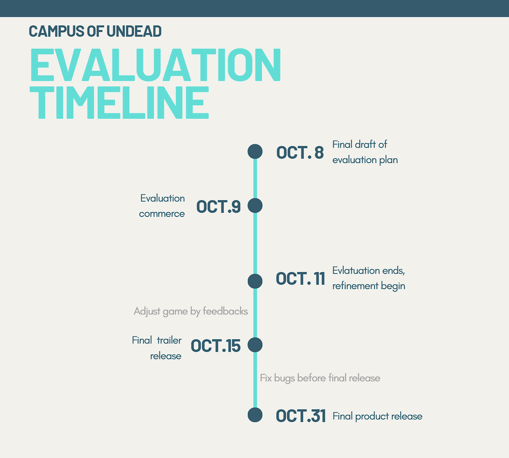

### Responsibilities

| Responsibility  | Team Member   |
| --------------- | ------------- |
| Questionnaires  | Warren Ang    |
| Interviews      | Shan Mou Liew |
| Data Collation  | Yue Song      |
| Data Analysis   | Xin Xiang     |

## Evaluation Report

### Game Evaluation Questionnaire

Google Forms: <https://docs.google.com/forms/d/1ra56tH51c8UmbpFKkSxLHqZu7B9IqPD2JyPaLRB7RMA/edit?ts=6527671b>

#### 1. Questionnaire Evaluation 📑

The game evaluation questionnaire, designed for "Campus of the Undead" has been administered via Google Forms to gauge user experience and feedback. The objective of this section is to critically analyse the design, structure, and user experience of the feedback form. 

**Advantages**⭐:  

- The questionnaire is segmented into distinct sections like game control, UI, and sound effects, offering respondents a clear path to articulate their experiences and feedback.  
- The use of a 5-point Likert scale simplifies data interpretation, making it easier to discern satisfaction trends and pinpoint areas needing improvement.  
- The diverse array of questions guarantees that feedback touches on multiple facets of the game, ensuring a comprehensive review process. 
- The inclusion of an open-ended question at the end facilitates deeper, more personalized user insights, capturing feedback beyond the scope of predefined questions. 
- The familiar design of Google Forms makes it user-friendly, promoting better respondent engagement. 
- Google Forms' capabilities of instant data aggregation and visualization speed up the analysis, aiding in quicker, feedback-informed decision-making. 

**Improvements**🛠️:

- Restricting feedback to preset questions might limit the depth of insights, overlooking some subtle yet crucial user perspectives. 
- The 1-5 rating scale might lead to a central tendency bias, with responses gravitating towards neutral scores. 
- Google Forms lacks the feature for direct screenshot or video clip uploads, a significant drawback for capturing visual feedback in a game setting. 
- Google Forms' limited customization options might not resonate with the game's aesthetic theme, creating a potential disconnect in the user's feedback experience. 
- Some questions may appear overlapping or vague. Ensuring each question is distinct and clear can uplift the feedback's quality. 
- A lengthy form could discourage comprehensive responses. Implementing navigational aids or progress indicators might improve user engagement throughout the feedback process. 
  
#### 2. Questionnaire Feedback Analysis 📈

- **Part I. Game Control:**  
Participants largely praised the game controls and aiming, with many awarding scores of 4 or 5 out of 5. Given this positive sentiment, significant alterations seem unnecessary. However, to ensure broad appeal, additional testing involving a more varied group of players could verify the controls' widespread intuitiveness.

 
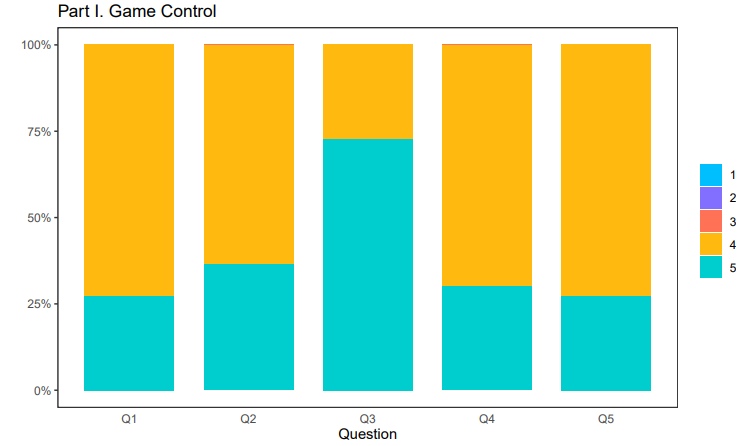

***All figures in this section illustrates the analysis of our questionnaire results. On the x-axis, we have the various questions from each section, with scores ranging from 1 to 5 representing the responses. The y-axis denotes the percentage of testers who awarded the respective scores.**
 

- **Part II. UI:**  
Feedback about the menu's usability and layout was varied, indicating some players faced challenges. While the display of character stats, notably health and ammo, garnered a generally positive response, there was notable difficulty in identifying collectible items and comprehending the inventory. However, interactions and comprehension related to NPCs received commendations. The skill tree's clarity and the process of skill equipping evoked mixed feelings among players.

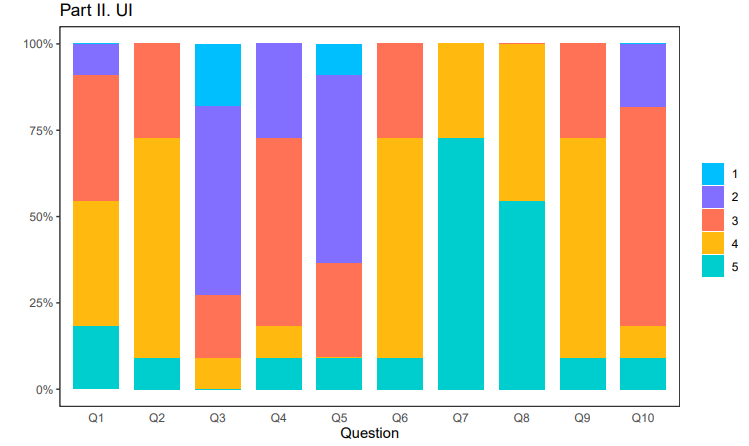

 

- **Part III. Sound Effects:**  
Sound design, particularly for zombies and weapons, resonated well with most testers, creating an immersive experience. There was no pervasive feeling of sound clutter, with players comfortably discerning various audio cues. A noteworthy portion of feedback highlighted a desire for ambient music, especially during explorative phases and boss encounters.

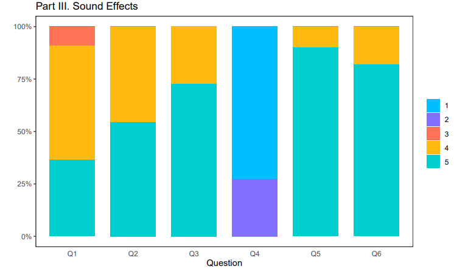

 

- **Open Comments:**  
Challenges in locating skill-unlocking items emerged as a prominent issue. Suggestions leaned towards enhanced visual indicators for collectible objects, feedback for zombie hits, and zombie health bars. The expansive map size was a recurrent concern, with players feeling the pressure of fulfilling objectives in the stipulated timeframe. There's also a collective call for sharper game objectives and more intuitive default controls.

### Cooperative Evaluation

#### 1. Cooperative Evaluation 📑

On top of the questionnaires, in order to exchange ideas and thoughts with the testers, we opt ofr the cooperative evaluation method to assess the prototype of our game "Campus of the Undead". For the cooperative evaluation, we analyse our results by the participants' gaming experience or gamer level to provide another perspective for our evaluation. Our objective was to gather more diverse feedback from players, gamers, developers and designers with different gaming experience to enhance the overall gaming experience. By conducting 6 of playtesting sessions with our participants, we aimed to identify gameplay issues, bugs, and design inconsistencies. 

**Advantages**⭐:  

- Cooperative evaluation incorporates feedback from various stakeholders, including players, developers, designers, and experts and different level of gaming experience. This diverse range of perspectives provides comprehensive insights into the game's strengths and weaknesses.  
- Participants can identify issues related to gameplay, mechanics, graphics, and overall user experience. This detailed feedback allows us to make targeted improvements. 
- During playtesting sessions, we can observe players' reactions and challenges in real-time. This observation enables immediate adjustments and fine-tuning of the game elements.  
- Cooperative evaluation allows for iterative development, where feedback is implemented, and the game is re-evaluated. This iterative process leads to continuous enhancement, resulting in a polished final product.  
- By involving players directly in the evaluation process, we can create games tailored to user preferences, increasing the likelihood of the game being well-received by the target audience. 
  
**Improvements**🛠️:

- Organizing playtesting sessions with the participants requires time, effort, and resources, limiting the number of participants we can include in our evaluation phase  
- The number of participants in cooperative evaluation sessions is limited to 6 due to logistical constraints. A small sample size might not accurately represent the diverse player base, leading to skewed results. 
- Evaluations are subjective and dependent on individual perceptions. What one player finds enjoyable, another might dislike. Balancing conflicting feedback can be challenging for us. 
- Participants' feedback might be influenced by personal preferences, gaming backgrounds, and cultural differences. During our analysis, we often found conflicting feedbacks from players with different gaming experience. 

#### 2. Cooperative Evaluation Feedback Analysis 📈

Result Raw Data: <https://docs.google.com/document/d/1ABumLmGtkTG7LA1sTayPQfh1B8Xo9X8NRuSPXUjLixs/edit>

- **Casual Gamers**  
    - - **Positive Feedback:**
  - The creative idea of the game and the overall game design.
  - **Difficulties Faced:**
    - Completing the game within the given time frame.
    - Locating pickable items due to poor visibility.
    - Navigating the game world and understanding objectives.
    - Grasping controls, leading to frequent reference to help menus.
  - **Suggestions**
    - Reduce map size for easier navigation.
    - Improve item visibility through better highlighting techniques.
    - Implement an intuitive tutorial or introductory cutscene.
    - Simplify control schemes and provide in-game guidance
    - Enhance menu layouts, provide clear instructions, and introduce navigational cues or a mini-map for orientation.

- **Hardcore Gamer**  
  - **Positive Feedback:**
    - Graphics and Overall Game Design
  - **Difficulties Faced:**
    - Frame rate drops and occasional glitches affecting immersion.
    - Lack of understanding regarding game backstory, objectives, and winning system.
    - Absence of alternative control options and customization features.
  - **Suggestions:**
    - Address technical issues like frame rate drops and glitches.
    - Provide a transparent explanation of the game's backstory and mechanics.
    - Introduce customizable controls, key bindings, and support for controllers/gamepads.
    - Incorporate adjustable difficulty levels for a more inclusive experience.

- **Game Enthusiast**  
  - **Positive Feedback:**
    - Intuitive controls and pick-up-and-play nature.
    - Enjoyment of exploration and skill development mechanics, akin to RPG experiences.
  - **Suggestions:**
    - Integrate social features such as leaderboards and multiplayer modes for increased engagement and replayability.

- **Novice/Non-Gamer**  
  - **Difficulties Faced:**
    - Basic movement control difficulties leading to frequent disorientation.
    - Motion sickness from the first-person perspective.
    - Lack of understanding game objectives and complex menu layouts.
  - **Suggestions:**  
    - Implement more intuitive controls and provide guidance without disrupting gameplay flow.
    - Offer an option for a third-person perspective to alleviate motion sickness.
    - Simplify objectives, menu layouts, and provide clear in-game instructions.

### Modifications and Improvements 🕹️

- **Menu & UI**:  
We've overhauled the game's menu to provide a more intuitive display of skills and have addressed existing bugs for smoother navigation.

- **Gameplay Dynamics:**  
 **a.**
  Zombies have been adjusted to respawn at a balanced rate, ensuring players feel challenged while also having time to explore the campus.  
 **b.**
  The game's dynamics have been enhanced with the Boss now spawning at the start, chasing the player. This not only intensifies the gameplay but also simplifies the game mechanism, ensuring a more concise play duration.  

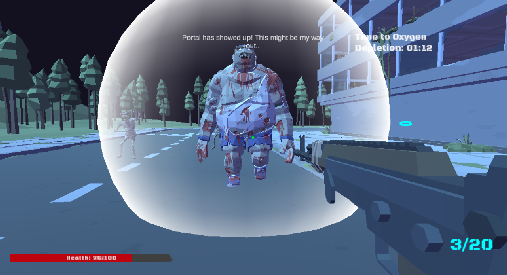

- **Item Visibility:**  
Pickable items are now distinctly highlighted to set them apart from the environment. Moreover, there's a differentiation in the highlight colors between regular items and key items. This, combined with the introduction of clear indicators and pop-ups, aids players in understanding the game's objectives from the start.

| 
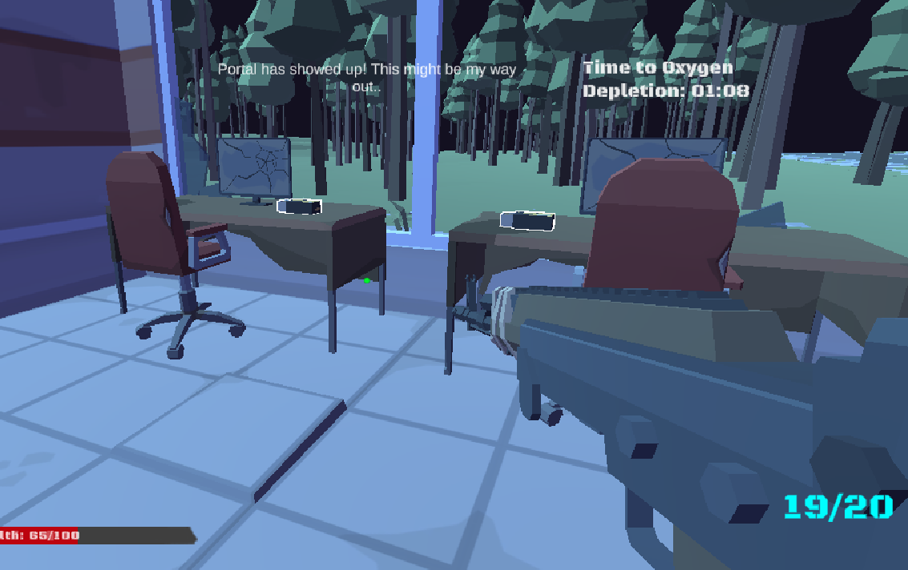
 | 
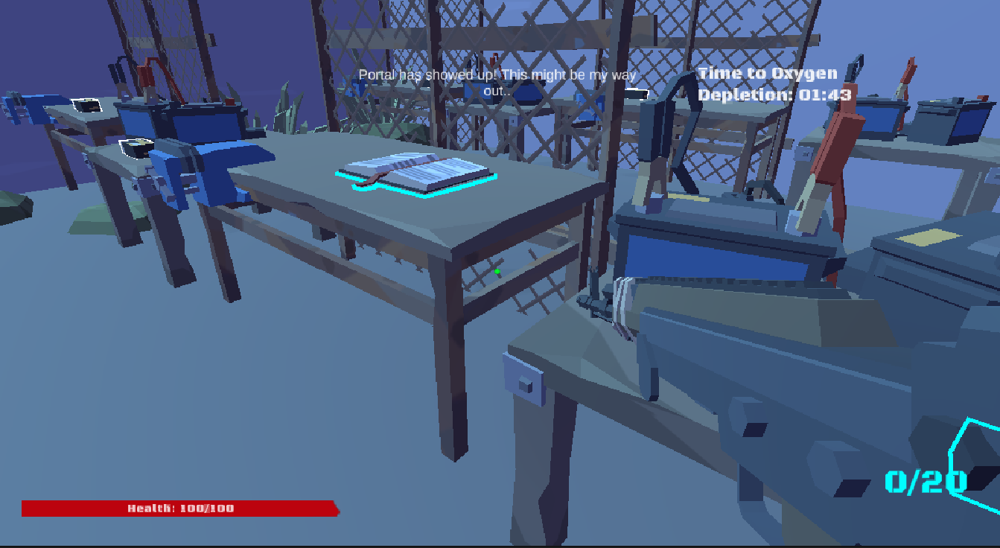
 | 
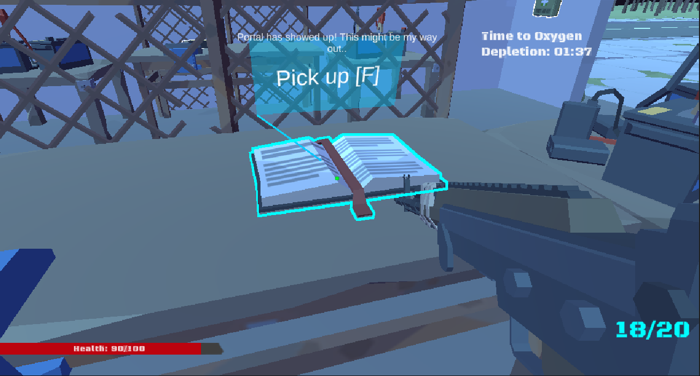
 |
| --------------------------------------- | --------------------------------------- | --------------------------------------- |
| Pickable items are highlighted          | Key items are highlighted differently | Items are highlighted differently when aimed with a pop up window |

- **Sound and Music:**  
We have retained the popular sound effects associated with zombies and weapons. To cater to the feedback regarding ambient music, we've incorporated ambient tracks that players can enjoy during their exploration.

- **Instruction:**  
To give players a clear understanding from the outset, we've introduced an opening video. This video emphasizes the game's core objective, which is to survive by combating zombies.

- **NPC Integration for Guidance:**  
A new NPC is strategically placed near the player's spawn point. This NPC serves as an informative guide, especially for newcomers. It offers insights into the game's lore, the skill tree, and basic gameplay mechanics. The NPC is also instrumental in assisting players locate essential items at the game's commencement.

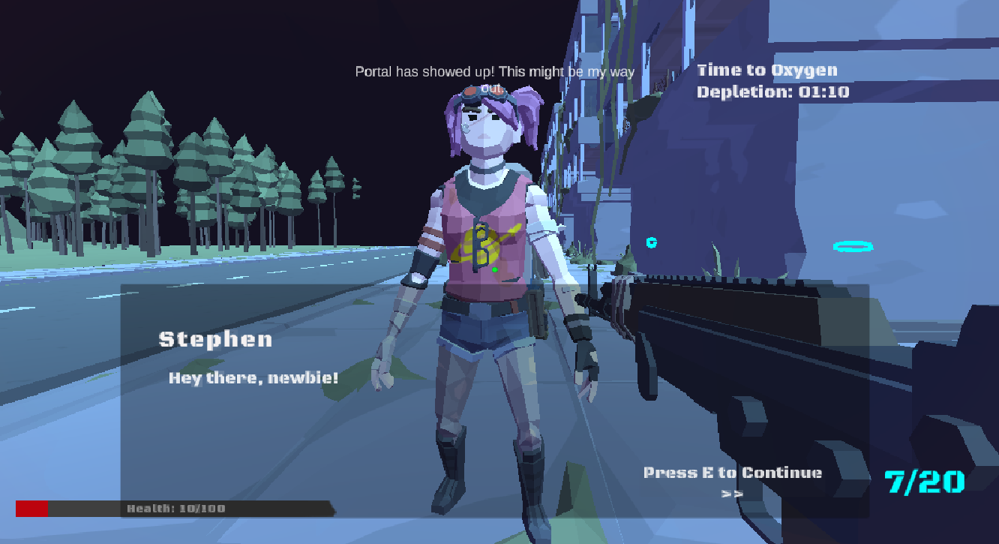

 

- **Enhanced Visual Feedback:**  
We've introduced visual effects, like blood splatter, which are triggered when zombies are hit. This gives players immediate feedback on their actions.

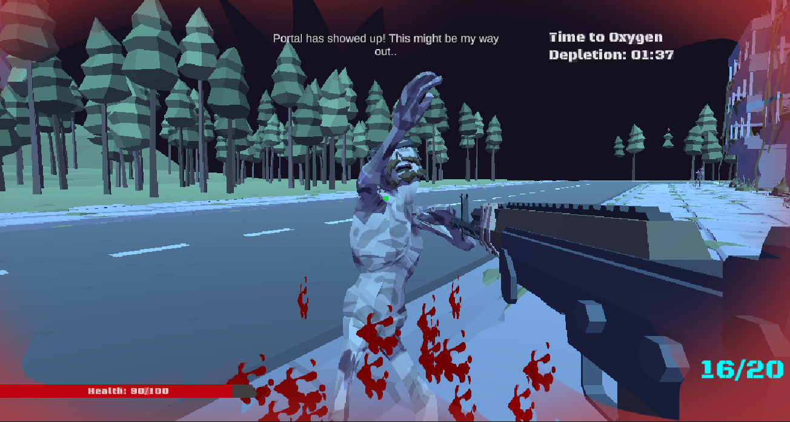

 

- **Map Adjustments:**  
Based on consistent feedback about the map's expansive size, we've optimized it to suit a 5-minute playtime. To aid navigation, a map guide has been added. Players can now easily identify their location on this map, represented by a green dot.

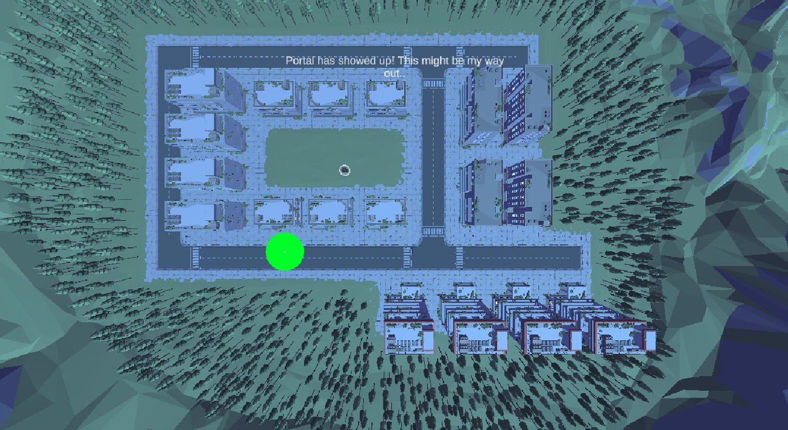

 

## Shaders and Special Effects

### Force Field Shader

[ForceField.shader](Assets/Shaders/ForceFieldShader/ForceField.shader)
  
The shader creates the force field effect using the fresnel effect.

#### Fresnel Effect

The fresnel effect is the observation that the amount of reflectance seen on a surface depends on the viewing angle.

  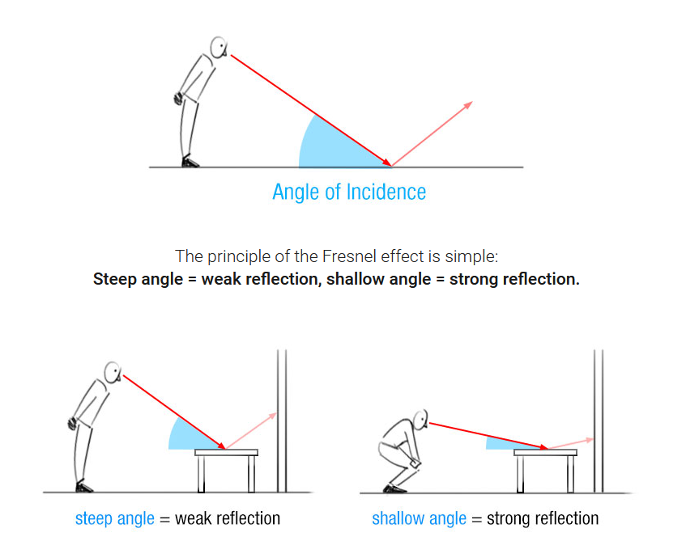
  
Fresnel effect on flat surfaces. From https://www.dorian-iten.com/fresnel/.

  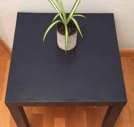
  
Fresnel effect in real life. From https://www.dorian-iten.com/fresnel/.

On curved surfaces, the angle of incidence gets shallower towards the edges. On a sphere, the fresnel effect leads to the reflections being the strongest on the edges.

  
  
Fresnel effect on curved sufaces. From https://www.researchgate.net/figure/Principle-of-the-Fresnel-effect-the-amount-of-reflection-on-a-reflective-surface-depends_fig3_319178578.

#### Fresnel Shader

To create the force field effect, a fresnel shader is applied on a sphere. But instead of varying the amount of surface reflectance based on the angle of incidence, the shader varies the surface glow based on the angle of incidence. The fresnel shader leads to the surface glow being the strongest on the edges.

  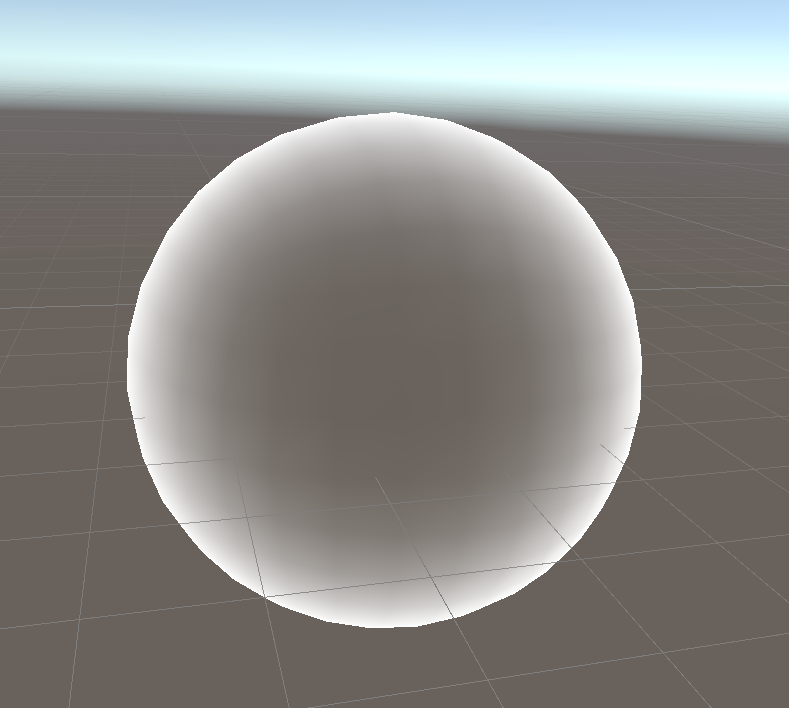
  
Force field effect.

Firstly, the shader implements a vertex shader to transform each vertex from object space to clip space and calculate the fresnel reflection strength for each vertex based on the angle of incidence between the vertex and the camera.

Then, the shader implements a fragment shader, which uses the fresnel reflection strength for each vertex as the corresponding fragment's alpha value. The alpha value determines the fragment's glow. The RGB colour for the fragment is calculated based on the linear interpolation between the glow colour shader property and edge colour shader property, controlled by the fragment's alpha value. Finally, the RBGA colour for the fragment is constructed by combining the calculated RGB colour for the fragment and the fragment's alpha value.

In summary, the vertex shader calculates the vertices fresnel reflection strength. Then, the fragment shader uses the vertices calculated fresnel reflection strength to create a glow effect.

  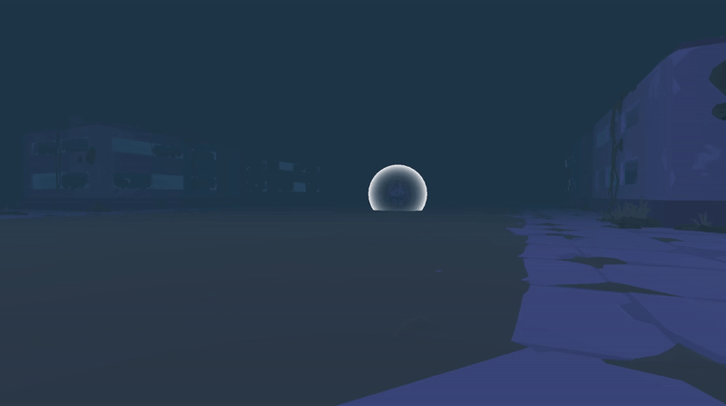
  
Force field effect in action. 

### Portal Shader

[WaterShader.shader](Assets/Shaders/WaterShader/WaterShader.shader)

This shader is a modified version of water shader, from tutorial <https://www.youtube.com/watch?v=wcGT_jji5xQ>

  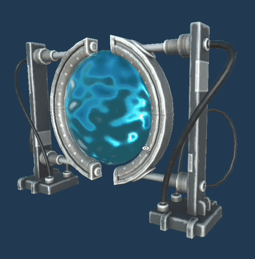
  
Portal effect shader.

#### How it works

The portal effect is achieved by modifying a water shader. First, we create a plane of water by randomly moving its vertices up and down to simulate waves using a noise texture. Next, we apply the water texture to the normal texture. Finally, we calculate camera depth, transform it to a variable between 0-1, and apply it to the texture's alpha to further mimic the effect of the water's opacity increasing with its depth.

To turn the water shader into a portal shader, we use a different texture which better simulates the effect of a twisted portal space, then we set the alpha to be always maximum to make the effect more obvious.

Noted that the waves can only be seen when there is a light source, to make the effect more obvious, we further attached two point lights beside the portal.

### Blood Particle System

[Blood.prefab](Assets/Prefabs/Effects/Blood.prefab)
#### How it works

  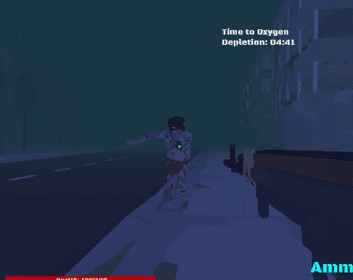
  
Blood Effect.

The particle system’s randomness and the ability to spray particles inspire us to use it to implement blood splashes when a zombie is hit. We use a single drop of blood as a single particle and generate a blood splash by randomly emitting blood particles from one point.

#### Base texture

  
  
Base texture.

The base texture of blood particle is a hand-drawn blood splash. We replace the default soft edge dot with this texture to mimic blood splashes.

#### Duration, Speed and looping

  
  
Blood effect particles.

The duration is rather short and the speed is fast to mimic the effect of hitting by a bullet, and it is not looping because we want it to play only once per hit.
Size over lifetime

Although it is not obvious because of the short duration, we set the size over the lifetime to be decreasing to mimic how blood drops become smaller when they are further away from the hit point.

#### Randomness

We use auto-random seed to generate different particle patterns on each play. We also set the arc shape to random so that we could get blood drops emitting in different directions

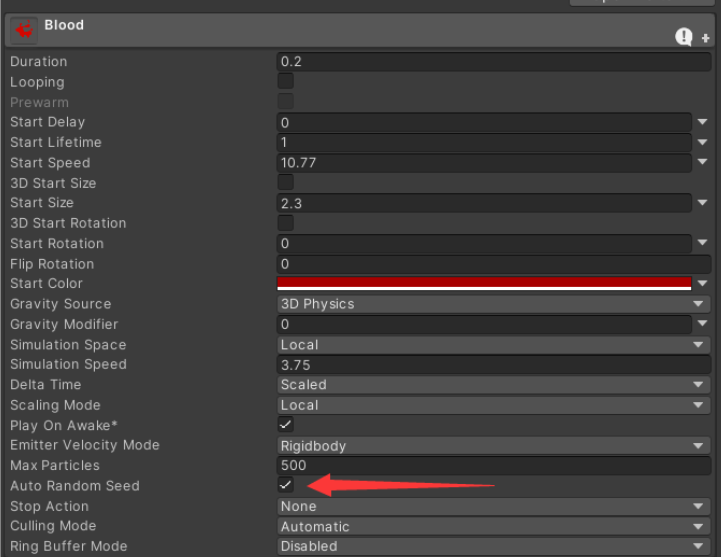
  
Auto Random Seed is active.

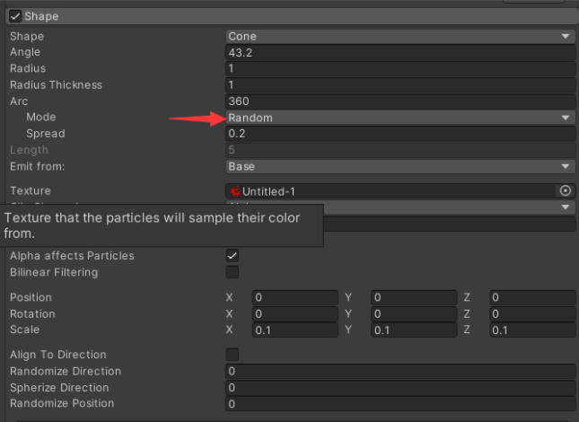
  
Random arc is active.

## Summary of Contributions

In the development of our Unity game, each team member brought specialized skills and contributions to ensure the successful completion of the project. Here's a summarized breakdown of the roles and responsibilities taken on by each member:

- **Warren Ang:**  
**Game World Design:**  
Warren took the lead in designing and constructing the game world. His detailed arrangement of in-game elements transformed the play space into a captivating and interactive environment. 
**Mapping:**  
Warren delineated map boundaries, deftly guiding players and ensuring their immersion within the designated game zone. To amplify the gaming experience, he seamlessly integrated ground colliders, mesh elements, and distinctive faculty items. 
**Force Field Shader:**  
To augment the dramatic tension during boss battles, Warren ingeniously integrated a force field shader for immersive visual enhancements. 

- **Shan Mou Liew (Jenson):**  
**UI/UX Design:**  
Jenson was pivotal in refining the game's user interface and experience. He meticulously designed the game map UI, main menu, pause screen, timer display, player selection interface, HP bar, and all embedded game UI elements. 
**Game Mechanics:**  
Demonstrating technical prowess, Jenson incorporated diverse in-game skills, essential item functions, and an innovative time mechanic, all contributing to enriched gameplay. 
**Inventory System:**  
Jenson architected a robust skills and inventory system, enabling players to effortlessly manage their in-game Story Points.  

- **Yue Song:**  
**Player Mechanics & UI:**  
Yue took the reins of player-related mechanics and their correlated UI, overseeing movement dynamics, interactions, and other core foundational gameplay elements. 
**Visual & Sound Effects:**  
Yue artfully crafted the grass and portal shaders and conceptualized a blood particle system, enhancing player immersion. His integration of shooting sound effects and the ammo drop feature further heightened in-game realism. 
**Game Enhancements:**  
Yue's ingenuity shone through in his development of the pivotal boss spawn mechanics. 

- **Xin Xiang:**  
**Character Design & Sound:**  
Xin was instrumental in designing the zombies and survivors in the game. She crafted their mechanics and integrated related animations to ensure a lifelike experience. 
**Audio Integration:**  
She added depth to the game through the integration of zombie sounds and background music. 
**Spawn System:**  
Xin developed a system for zombies to spawn within the game, enhancing the challenge for players. 
**Tutorial:**  
Recognizing the need for player guidance, Xin designed a tutorial section to introduce beginners to the game's mechanics. 

## References and External Resources

### Reference

Brackeys. (2019, April 29). FORCE FIELD in Unity - SHADER GRAPH. www.youtube.com. https://www.youtube.com/watch?v=NiOGWZXBg4Y&t=671s.  
Code Monkey. (2022, October 13). How to Talk to NPCs! (or Interact with any Object, Open Doors, Push Buttons, Unity Tutorial). www.youtube.com. https://www.youtube.com/watch?v=LdoImzaY6M4.  
Code Monkey. (2019, February 16). Apex Legends Health System built in Unity - Code Monkey. Unitycodemonkey.com. https://unitycodemonkey.com/video.php?v=oLEEPL2WmAk  
Code Monkey. (2019a, January 11). How to make a Tooltip Warning - Code Monkey. Unitycodemonkey.com. https://unitycodemonkey.com/video.php?v=qcvaXzfhYuI  
Code Monkey. (2019b, January 11). Simple Skill Tree in Unity (Unlock Abilities, Talents) - Code Monkey. Unitycodemonkey.com. https://unitycodemonkey.com/video.php?v=_OQTTKkwZQY  
Code Monkey. (n.d.). Code Monkey - Utilities. Unitycodemonkey.com. Retrieved July 1, 2020, from https://unitycodemonkey.com/utils.php  
Single Sapling Games. (2021, October 14). Adding Animations To The Zombie - FPS Game With Unity & Blender. www.youtube.com. https://www.youtube.com/watch?v=I3sY3I_f5_o.  
tutorialsEU. (2021, December 15). Make a FIRST PERSON SHOOTER in UNITY - 3 HOUR COURSE - Unity FPS Game. www.youtube.com. https://www.youtube.com/watch?v=Jk85v08gmtc.  

### External Resources

Animus Digital. (2019, July 19). Zombie Animation Pack Free | 3D Animations | Unity Asset Store. assetstore.unity.com. https://assetstore.unity.com/packages/3d/animations/zombie-animation-pack-free-150219.  
Idia Software LLC. (2019, April 25). Free Zombie Character Sounds | Creatures Sound FX | Unity Asset Store. assetstore.unity.com. https://assetstore.unity.com/packages/audio/sound-fx/creatures/free-zombie-character-sounds-141740#publisher.  
Kevin Iglesias. (2023, January 26). Basic Motions FREE | 3D Animations | Unity Asset Store. Assetstore.unity.com. https://assetstore.unity.com/packages/3d/animations/basic-motions-free-154271.  
MoCap Online. (2019, June 21). ZOMBIE Starter: MoCap Animation Pack | 3D Animations | Unity Asset Store. assetstore.unity.com. https://assetstore.unity.com/packages/3d/animations/zombie-starter-mocap-animation-pack-61492.  
Synty Studios. (2023, April 26). POLYGON Apocalypse - Low Poly 3D Art by Synty | 3D Environments | Unity Asset Store. assetstore.unity.com. https://assetstore.unity.com/packages/3d/environments/urban/polygon-apocalypse-low-poly-3d-art-by-synty-154193.  
Tybug Studios. (2021, June 17). Zombie Voice Audio Pack - Free | Creatures Sound FX | Unity Asset Store. assetstore.unity.com. https://assetstore.unity.com/packages/audio/sound-fx/creatures/zombie-voice-audio-pack-free-196645.  
